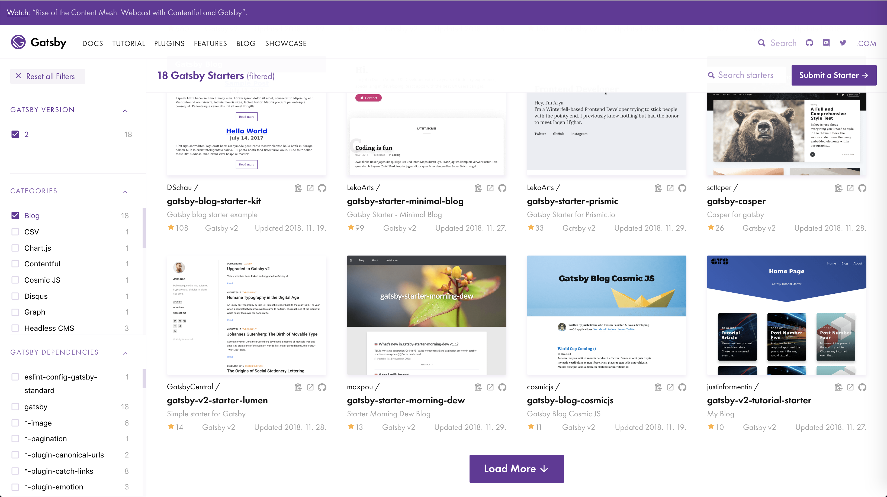
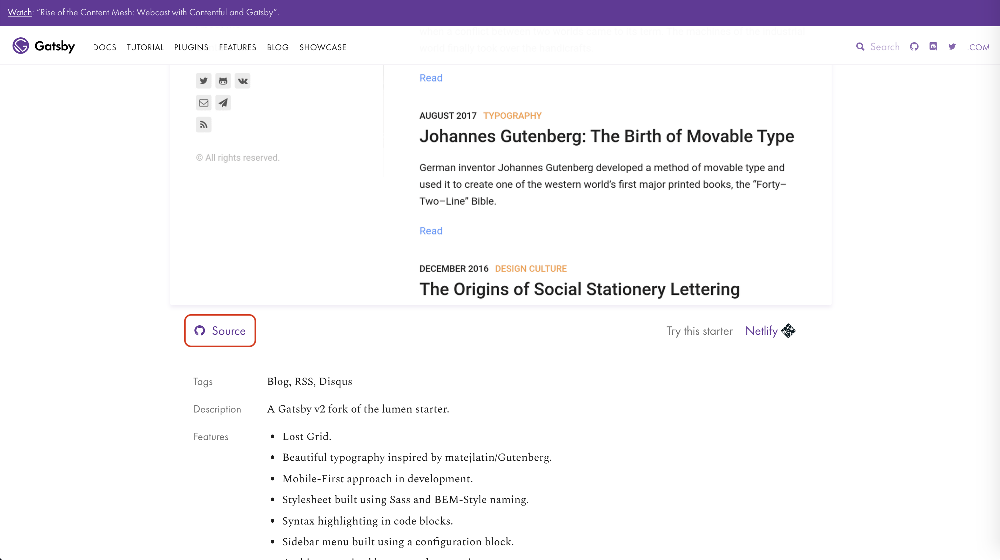
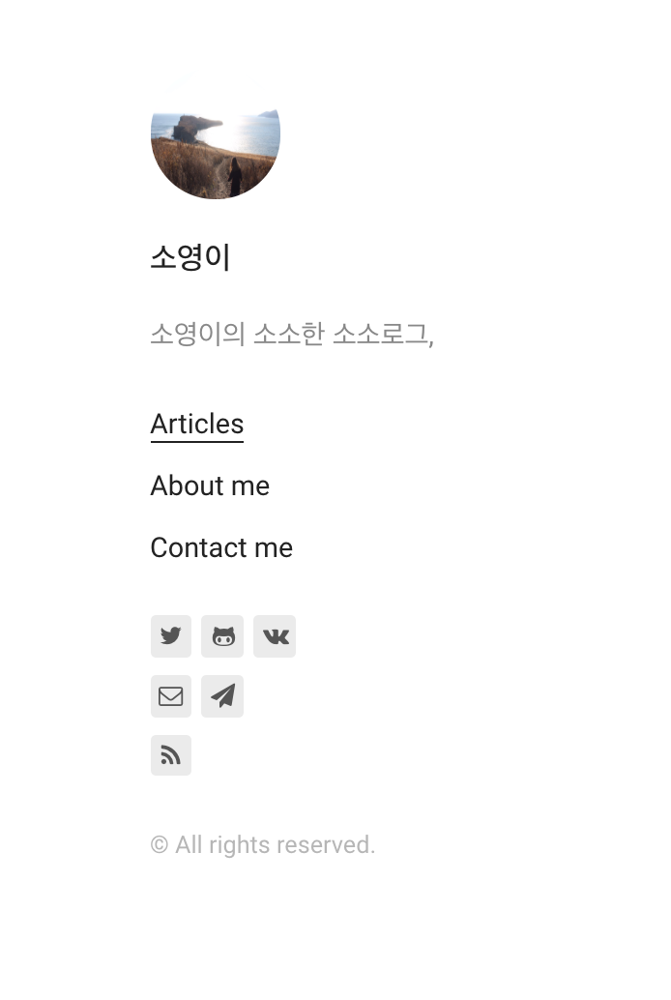
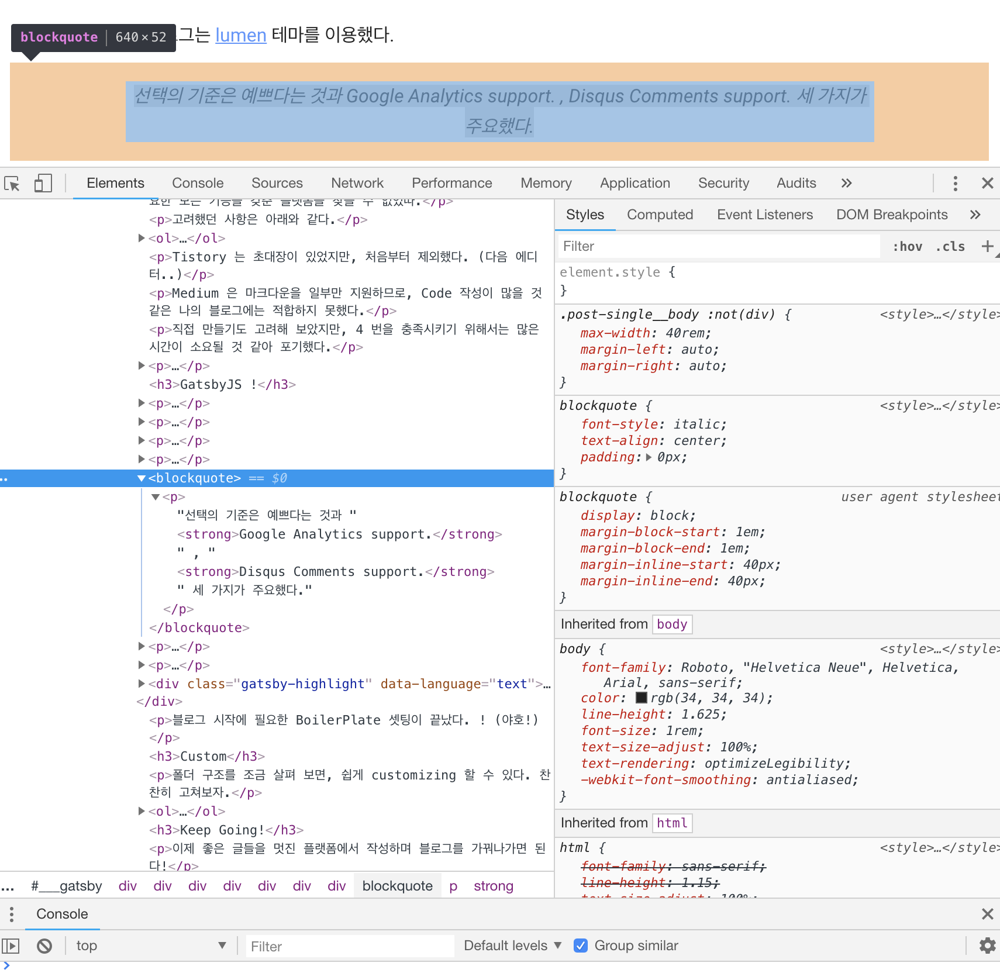
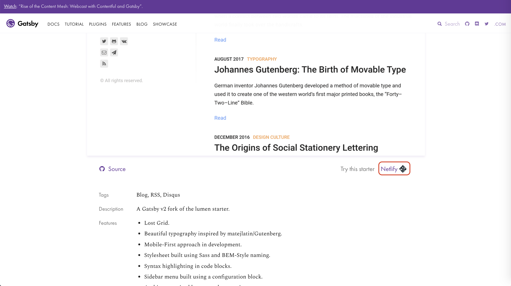
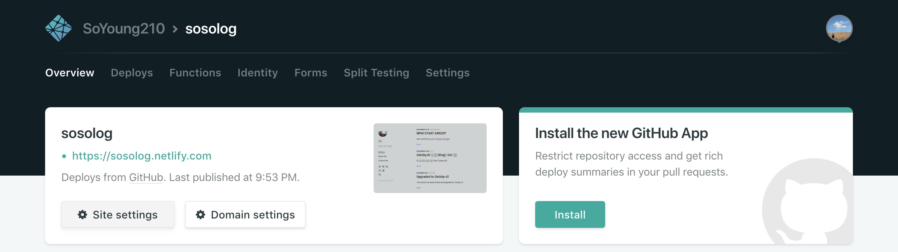

## 플랫폼 선정

블로그의 첫 포스팅은 **어떻게 이 블로그를 만들었는가?** 에 관한 글이다.

블로그에 대한 needs 는 꽤 오래전 부터 있었는데, 적당한 플랫폼을 찾지 못하겠다는 이유로 미루던 중이었다.

Tistory, Medium, 심지어 직접 만들기 까지 고려해 보았지만 필요한 모든 기능을 갖춘 플랫폼을 찾을 수 없었따.

고려했던 사항은 아래와 같다.

1. MarkDown 이 거의 완벽히 지원될 것
   - Code Editor, Bold, h1,h2.. , one Line Block etc.
2. 사진 업로드에 적합할 것
3. 블로그 플랫폼 외에 셋팅해야 할 것이 적을 것.
   - 블로그 글 하나 올리기 위해 3 개 파일씩 건드리고 이런 것을 지양하는 편.
4. 예쁠 것

Tistory 는 초대장이 있었지만, 처음부터 제외했다. (다음 에디터..)

Medium 은 마크다운을 일부만 지원하므로, Code 작성이 많을 것 같은 나의 블로그에는 적합하지 못했다.

직접 만들기도 고려해 보았지만, 4 번을 충족시키기 위해서는 많은 시간이 소요될 것 같아 포기했다.

결국 이미 만들어진 플랫폼 외에 **가능한 셋팅이 적을** 플랫폼을 찾게 되었고, 흘러흘러 `GatsbyJS` 를 찾게 되었다.

## GatsbyJS !

`GatsbyJS` 는 우선 1,2,3 을 충족 시켰고, 많은 [Starter](https://www.gatsbyjs.org/starters/?v=2) 를 제공함으로써 4 번까지 한번에 만족시켰다.



`Categories` 에서 `Blog` 옵션을 선택하면 이미 잘 만들어진 일종의 Blog BoilerPlate 가 많다.

이 블로그는 [lumen](https://www.gatsbyjs.org/starters/gatsby-v2-starter-lumen) 테마를 이용했다.

> 선택의 기준은 예쁘다는 것과 **Google Analytics support.** , **Disqus Comments support.** 세 가지가 주요했다.



**Source** 를 클릭하면 [gatsby-v2-starter-lumen](https://github.com/GatsbyCentral/gatsby-v2-starter-lumen) 로 이동한다.

```
$ npm i -g gatsby-cli
$ gatsby new [BLOGNAME]https://github.com/GatsbyCentral/gatsby-v2-starter-lumen
```

블로그 시작에 필요한 BoilerPlate 셋팅이 끝났다. ! (야호!)

## Custom

폴더 구조를 조금 살펴 보면, 쉽게 customizing 할 수 있다. 찬찬히 고쳐보자.

1. 좌측 프로필

   좌측 프로필은 `gatsby-config.js` 를 수정하면 된다.

   `title` , `menu` , `author` 등을 수정하면 기본 정보를 셋팅할 수 있다.

   > 직접 바꿔보며 결과를 확인하는 식으로 하면 어렵지 않다.

   프로필 사진은 `src/components/Sidebar` 의 `index.jsx` 에서 사진을 바꿔주면 된다.

   이 블로그에선,

   ```js
   import profilePic from '../../pages/photo.jpeg'
   {
     /*생략...*/
   }
   <div>
     <Link to="/">
       
     </Link>
   </div>
   ```

   이런식으로 변경했다.

2. post

   포스트는 `src/pages/articles` 경로에서 수정할 수 있다.

   markdown 형식으로 작성하면 된다.

1. style 
   화면에 보여지는 형식을 바꾸고 싶다면, 다음 방법을 사용하면 된다. 
   예를 들어, 마크다운 문법 중 인용문구에 대한 스타일을 변경하고 싶다고 가정해 보자. 

   

   기본 스타일은 `text-align: center` , `font-style : italic` 이다.  
  우선, 이 텍스트가 어떤 태그에 의해 스타일 되는 지 알아야 한다.    
   해당 부분을 **요소 검사를 이용해서 확인해 보자,.**

   

   `<blockquote>` 태그에 의해 스타일이 적용되고 있다.   이 태그에 적용되는 스타일만 바꿔주면 된다. 

   해당 태그를 검색하면,  `src/scss/base/_generic.scss`  에서 스타일이 적용되고 있는 것을 확인할 수 있다. 
  ```css
  blockquote {
      padding: 0;
      font-style: italic;
      color: #979797;
  }
   ```
  이제 인용문구에 대한 디자인이 다음과 같이 변경 되었다. 

   

## Deploy

배포는 [Netlify](https://app.netlify.com/) 를 사용했다.  

정적 페이지를 무료 호스팅 해주는 사이트로, 간단한 조작만 하면 금새 배포할수 있다. 

직접 GitHub 으로 로그인 후 어떤 Repo를 배포할 것인지 선택해도 되지만, 클릭 몇번 으로 다 잡아줄 수 있다.  



[Netlify_with_lumen](https://app.netlify.com/start/deploy?repository=https://github.com/GatsbyCentral/gatsby-v2-starter-lumen) 에서 lumen 테마의 블로그를 바로 만들고 배포할 수 있다. 

이 과정에서 GitHub 로그인, Repo 생성, lume 테마 클론 과정이 이루어 지고 기본적인 샘플이 master로 배포된다. 




`Site settings` 에서 변경할 수 있는 **Site name** 에 의해 블로그 주소가 결정 된다. 

결제를 하면, 완전히 내가 원하는 도메인을 사용할 수 있지만 기본적으로는 [site name].netlify.com 으로 결정된다. 

배포 브랜치는 기본적으로 `master`   브랜치 이고 이 설정도 변경 가능하다. 


자 이제 첫 배포가 끝났다! 이

## Keep Going!

이제 좋은 글들을 멋진 플랫폼에서 작성하며 블로그를 가꿔나가면 된다.

사실 아직 discussion 기능이나 GA, TOC ~~하물며 favicon도..~~ 등의 작업이 남았지만 이러한 사항들은 적용하는 대로 추가로 포스팅할 예정이다.

> 그래서 혹시 질문사항이 있으시다면 당분간은 저의 메일로 주셔도 됩니다! 

## 추가 사족
'왜 블로그를 시작 했는가?' 에 대한 질문에 대한 답으로 첫 블로그 포스팅을 마치려 한다.  
블로그를 운영하시는 많은 개발자 분들이 참 대단하다고 생각했고, 나는 절대 ~~귀찮음을 느껴서~~ 못할 작업이라고 생각했다. 

귀찮음을 뚫고 **나도 블로그 해보고 싶다.** 라고 느꼈던 그 시작은 처음 면접 준비를 하면서 이다. 

### 자료 끌어 모으기.
그 전에도 간간히 회고 글이나 [Study_Repo](https://github.com/SoYoung210/Study_note) 에서 공부한 내용을 정리하고 있었다.  
면접 준비는 주로, **인터넷 상에서 돌아다니는 많은 자료를 내가 이해할 수 있는 내용으로 정리해서 하나의 문서로 만드는 작업** 이었다.  
그 과정에서 GitHub 웹 에디터는 불편해서 Typora를 사용하게 되었고, 폴더 단위로 Web, JS, React+Redux+..(프론트 직군을 준비중이었다.) 학습한 내용을 정리하게 되었다. 

### 공유하기
마침 내가 구직하는 시즌에 이직을 준비하는 지인분이 계셨다.  
**내가 이미 알기 쉽게 정리한 내용을 공유하고 싶은 마음에** 작성한 내용을 공유 했다.  
내 자료가 누군가에게 도움이 될 수 있다는 사실에 뿌듯했다. 

### 한번 더 공부하기
나의 공부방식은 여러가지 양질의 정보를 습득하고, 문서화 시키는 과정에서 진짜 이해해 나가는 방식이다.  
블로그를 시작하기로 맘먹은 후 '아, 나중에 블로그 시작하면 포스팅 해야지' 라고 생각한 글들을 작성하며 **몰랐던 부분에 대해 정확히 이해** 할 수 있었다.  
사실 나만 볼 글은 그것이 고의던 아니던, 이해했다고 착각하고 넘어가게 되는 부분이 생겼다. 

하지만, **누군가가 내 글을 읽을 수 있다.** 라는 생각으로 글을 정리하다 보니, 더 좋은글 더 정확한 글을 작성하기 위해 더 찾아보고 더 공부할 수 있었다.  

### 결론
블로그 합시다! 
나도 한번 더 공부하고, 그 내용을 나눌 수 있는 1석 2조의 활동인것 같다.  

## Ref

https://wonism.github.io/create-blog-with-gatsby/
