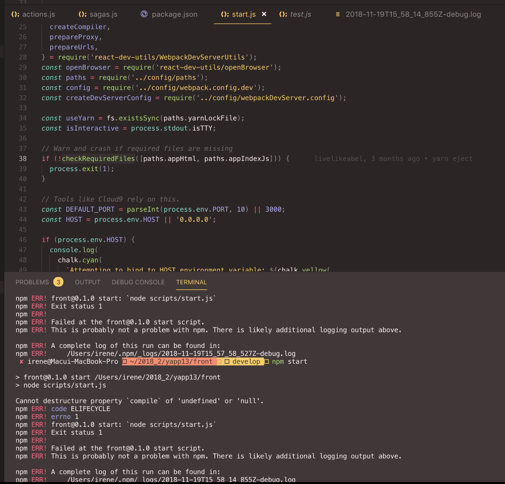

일단 한번 돌려보고 디버깅해야지! 에서 `일단 한번 돌려보고` 가 안됐다.



> 아니 이게 무슨 청천벽력 같은... 이 때 간단한 기능 구현만 하려고 새벽 1 시에 시작했다.

여러가지를 의심해 보았지만, 전부 정답이 아니었다.

> 여기서 여러가지란,
>
> 1. node_modeules 폴더와 packages.lock.json 파일을 삭제 후 다시 **npm install**
> 2. 포트사용중인 것 확인 해보기.

eject 는 상당히 오래전에 했고, 한번도 문제가 된적은 없었고 말그대로 **껐다 키기 전까지는 잘됐다.**

결론부터 말하자면, **webpack-dev-server 버전 문제** 이다.

```
"webpack": "3.8.1",

-  "webpack-dev-server": "^3.1.10",
+  "webpack-dev-server": "2.9.4",
```

## Why?

왜 webpack-dev-server 의 버전이 갑자기 올라갔을까?

> 여기서 중요한 포인트는, **의도적으로 올린 사람은 없다.** 라는 것이다.

어떤 라이브러리를 설치할 때, npm 의 새로운 기능인 `audit` 에 의해 취약점 분석 리포트가 나왔고,

**npm audit fix ** 를 실행했다.

> 이 아이가 범인이다...

`npm audit fix` 에 의해 **버전이 올라간 것이다. **

다음은, [webpack-dev-server 3 releaseNote](https://github.com/webpack/webpack-dev-server/releases/tag/v3.0.0) 이다. 여기서 주목할 점은,

- **Breaking change:** webpack v4 is now supported. Older versions of webpack are **not** supported.

`webpack-dev-server 3.0` 부터는 `webpack v4` 와 호환되고, 구 버전은 **지원되지 않는다.**

그래서 audit 에 의해 강제로 webpack-dev-server 만 강제로 버전이 올라갈 시, npm start 가 되지 않는 문제가 발생한 것이다.

## How To Solve ?

해결방법은 간단하다.

webpack-dev-server 를 downgrade 시키면 된다.

```
$ npm install webpack-dev-server@~2.9.4
```

원래 버전으로 맞추어 주었고, 이 후 npm start 는 정상적으로 실행 되었다.

## Ref

https://blog.outsider.ne.kr/1375

https://medium.com/codebrace/what-is-npm-audit-fix-bf1d7efefff7

[webpack-dev-server-Issue](https://github.com/vuejs-templates/webpack/issues/1229)