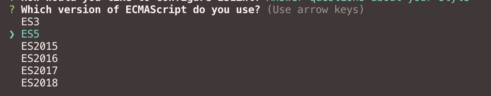

꼭 팀단위 프로젝트를 하지 않더라도, 코드를 어떻게 작성할 것인가에 대한 lint 규칙 설정은 필수이다. 

ESLint와 Prettier를 통해 정형화된 패턴을 만들 수 있다. 

## ESLint 란?

\- ES(EcmaScript) + Lint(보푸라기) 

\- 사용자가 정의한 Code Convention 을 지키고, 에러 체크를 도와주는 도구(Linter)

\- 협업에 유용한 도구로 개발자들이 같은 형태의 코드를 작성할 수 있도록 도와준다. 

ESLint의 목적은, **Code Quality** 를 유지하는 것이다. 

> 본래 목적은 정렬보다는 Bug를 방지하는 차원이 컸지만,  
Code Quality 를 높히는 것이 결국 가독성 좋은 코드를 작성하는 것과도 연결되므로, Prettier의 옵션들을 일부 가지고 있기도 하다. 

## Prettier 란?

프리티어는 전체 코드에서 일관된 **style** 을 가질 수 있도록 formatting 해주는 역할이다. 

가령, `;` 을 쓸것인가, Quote는 single 을 쓸것인가 double 을 쓸것인가 하는 code style 에 관한 규칙을 주로 지정한다. 

## ESLint vs Prettier

Lint에는 두 가지 규칙이 있다.

- Formatting rules : line 당 전체 길이, tab과 space 혼용, comma style..
- Code-quality rules: no-unused-vars, no-extra-bind, no-implicit-globals, prefer-promise-reject-errors ...

Prettier는 Formatting rules에서 필요한 부분에 대한 규칙을 정의할 수 있고, Code-quality rules 에는 관여하지 않는다. 

> Prettier 는 **Formatting을 주로!** , ESLint 는 **전체적인 Code Quality** 라고 생각하면 된다. 

## ESLint

우선 [ESLint](https://www.npmjs.com/package/eslint) 을 설치하고 기본적인 설정을 잡아준다.

1. ESLint 설치 

```
$ npm install -g eslint
$ npm install eslint --save-dev
```

> eslint 관련 명령어를 사용하는데 global 설치가 조금더 용이하다.
>
> 팀원간에 eslint 설정도 계속 공유되어야 할 필요가 있어 global, local 두 가지 방법으로 모두 설치했다. 

1. config 파일 셋팅에 필요한 명령어 

```
$ eslint --init
```

이 과정을 마치면 이렇게 물어본다. 


style을 직접 지정할 것이니, **Answer questions about your style** 을 클릭한다. 



원하는 ECMAScript 버전을 클릭하면 된다. (나는 2017을 선택한다!) 


- ES6 modules ? : import { sth } from "..." 와 같은 문법을 쓸것인가 ?

- Where.. code run ? : 어떤 환경에서 Code를 실행할 것인가?

- CommonJS 를 사용하는가 ? : Webpack을 사용한다면 **필수** 이다. 

- JSX 사용하는가 ? : 이 질문에서 주목할 점은, **JSX를 사용한다 !== React를사용한다.** 이다. 

  > https://babeljs.io/repl/ 에서 jsx 문법으로 class Component 를 작성 후, 변환되는 코드를 볼 수 있다. jsx 로 작성된 코드는 babel 에 의해 다르게 해석된다. 

- Reat를 사용하는가 ? : Yes! 

- "" or '' : 나는 '' 을 선택했다. 

- What line endings.. ? : 현재 사용하는 운영체제를 골라주면 된다. 

- semicolons ? : 나는 no semi!

- What format... ? : lint 설정 파일을 어떤 형식으로 만들 것인지 고르게 한다. JSON 이 편해서 JSON을 선택했다. 

이렇게 하면 `.eslintrc.json` 이 생성되었다. 

> 하지만, 나는 팀원들과의 상의를 통해 **airbnb rule** 을 customizing 하기로 했다.
>
> Use a popular style guide 에서 airbnb 을 선택하면 된다. 

## Prettier 얹고 규칙 설정 

1. Prettier 설치 

```
$ npm -D eslint-plugin-prettier eslint-config-prettier
```

1. .eslintrc.json 수정

```json
  ...
  "extends": [
    "airbnb",
    "plugin:prettier/recommended",
    "prettier/react"
  ],
  "plugins": [
    "prettier"
  ],
  "parser": "babel-eslint",
  ...
```

만약, dotenv 을 사용하고 있다면 옵션에 맞게 설정도 추가한다. 

```json
...
  "settings": {
    "import/resolver": {
      "node": {
        "paths": [
          "."
        ]
      }
    }
  },
...
```

prettier 설정을 통해 다음과 같은 규칙들을 추가로 적어주기로 하였다. 

- 코드 끝에 `;` 필수
- "" 대신 '' 사용
- tabWidth : 2
- printWidth : 80 (한 줄에 80라인의 코드만 적을 것)
- bracketSpacing : {sth} 대신 { sth } 과 같이 적을 것 
- trailingComma : 마지막 요소에 comma .. 

이 외에도 자잘한 규칙들을 팀원간 회의를 통해 결정하였다. 

```json
  ...
  "rules": {
    "import/prefer-default-export": "warn",
    "prettier/prettier": [
      2,
      {
        "singleQuote": true,
        "semi": true,
        "useTabs": false,
        "tabWidth": 2,
        "printWidth": 80,
        "bracketSpacing": true,
        "jsxBracketSameLine": false,
        "trailingComma": "all"
      }
    ],
    "react/jsx-filename-extension": [
      1,
      {
        "extensions": [
          ".js",
          ".jsx"
        ]
      }
    ]
  }
  ...
```

전체적인 코드에서 js 와 jsx 를 혼용해서 사용하고 있기 때문에 `extensions` 에서 js와 jsx를 추가해 주었다. 


## package.json 수정

\- src 경로에 있는 모든 js 파일을 ESLint 의 대상으로 간주하는 스크립트

\- node 를 같이 사용하지 않으려면 'eslint src/**/*.js' 명령을 콘솔에서 실행하면 된다.

```json
...
"scripts": {
"lint": "eslint src/**/*.js",
},
...
```

create-react-app 의 기본 lint 설정을 제거해 주었다.

```json
-  "eslintConfig": {
-    "extends": "react-app"
-  }
```

삭제. 

## RUN

```
$ ./node_modules/.bin/eslint src/**/*.js
```

다음 명령어를 사용하면 src 하위에 있는 js 파일들의 lint 검사를 진행할 수 있다. 


## Ref

http://songeunjung92.tistory.com/50

https://prettier.io/

Thx To, https://github.com/zeakd

 
