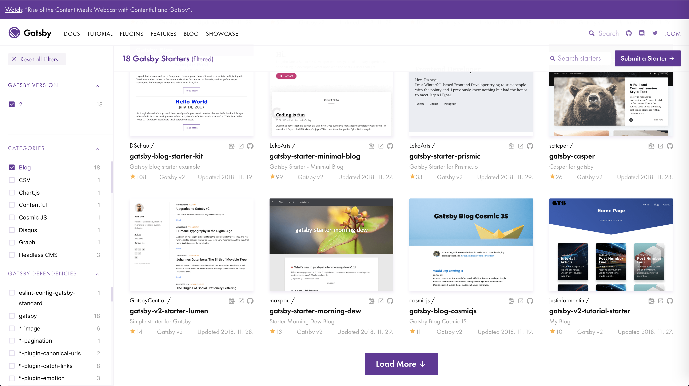
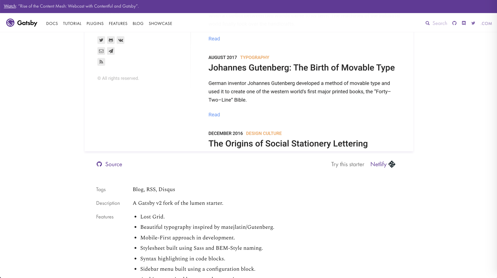
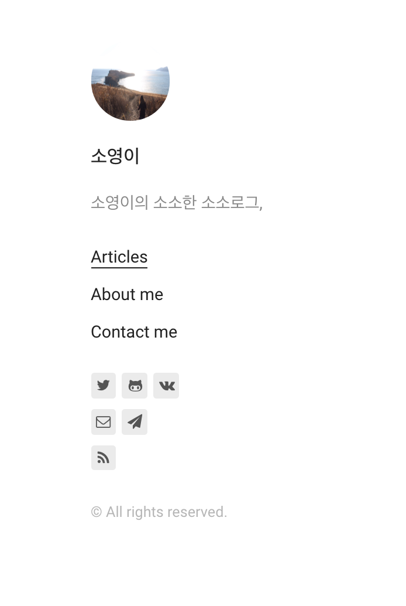

### 플랫폼 선정

블로그의 첫 포스팅은 **어떻게 이 블로그를 만들었는가?** 에 관한 글이다.

블로그에 대한 needs 는 꽤 오래전 부터 있었는데, 적당한 플랫폼을 찾지 못하겠다는 이유로 미루던 중이었다.

Tistory, Medium, 심지어 직접 만들기 까지 고려해 보았지만 필요한 모든 기능을 갖춘 플랫폼을 찾을 수 없었따.

고려했던 사항은 아래와 같다.

1. MarkDown 이 거의 완벽히 지원될 것
   - Code Editor, Bold, h1,h2.. , one Line Block etc.
2. 사진 업로드에 적합할 것
3. 블로그 플랫폼 외에 셋팅해야 할 것이 적을 것.
   - 블로그 글 하나 올리기 위해 3 개 파일씩 건드리고 이런 것을 지양하는 편.
4. 예쁠 것

Tistory 는 초대장이 있었지만, 처음부터 제외했다. (다음 에디터..)

Medium 은 마크다운을 일부만 지원하므로, Code 작성이 많을 것 같은 나의 블로그에는 적합하지 못했다.

직접 만들기도 고려해 보았지만, 4 번을 충족시키기 위해서는 많은 시간이 소요될 것 같아 포기했다.

결국 이미 만들어진 플랫폼 외에 **가능한 셋팅이 적을** 플랫폼을 찾게 되었고, 흘러흘러 `GatsbyJS` 를 찾게 되었다.

### GatsbyJS !

`GatsbyJS` 는 우선 1,2,3 을 충족 시켰고, 많은 [Starter](https://www.gatsbyjs.org/starters/?v=2) 를 제공함으로써 4 번까지 한번에 만족시켰다.



`Categories` 에서 `Blog` 옵션을 선택하면 이미 잘 만들어진 일종의 Blog BoilerPlate 가 많다.

이 블로그는 [lumen](https://www.gatsbyjs.org/starters/gatsby-v2-starter-lumen) 테마를 이용했다.

> 선택의 기준은 예쁘다는 것과 **Google Analytics support.** , **Disqus Comments support.** 세 가지가 주요했다.



Source` 를 클릭하면 [gatsby-v2-starter-lumen](https://github.com/GatsbyCentral/gatsby-v2-starter-lumen) 로 이동한다.

```
$ npm i -g gatsby-cli
$ gatsby new [BLOGNAME]https://github.com/GatsbyCentral/gatsby-v2-starter-lumen
```

블로그 시작에 필요한 BoilerPlate 셋팅이 끝났다. ! (야호!)

### Custom

폴더 구조를 조금 살펴 보면, 쉽게 customizing 할 수 있다. 찬찬히 고쳐보자.

1. 좌측 프로필

   좌측 프로필은 `gatsby-config.js` 를 수정하면 된다.

   `title` , `menu` , `author` 등을 수정하면 기본 정보를 셋팅할 수 있다.

   > 직접 바꿔보며 결과를 확인하는 식으로 하면 어렵지 않다.

   프로필 사진은 `src/components/Sidebar` 의 `index.jsx` 에서 사진을 바꿔주면 된다.

   이 블로그에선,

   ```js
   import profilePic from '../../pages/photo.jpeg'
   {
     /*생략...*/
   }
   ;<div>
     <Link to="/">
       
     </Link>
   </div>
   ```

   이런식으로 변경했다.

2. post

   포스트는 `src/pages/articles` 경로에서 수정할 수 있다.

   markdown 형식으로 작성하면 된다.

### Keep Going!

이제 좋은 글들을 멋진 플랫폼에서 작성하며 블로그를 가꿔나가면 된다!

## Ref

https://wonism.github.io/create-blog-with-gatsby/
